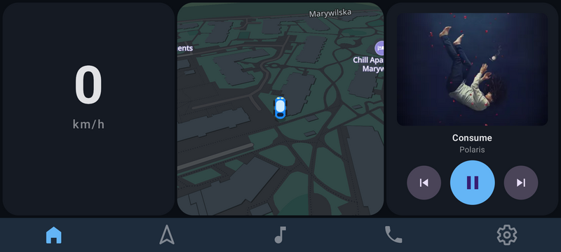
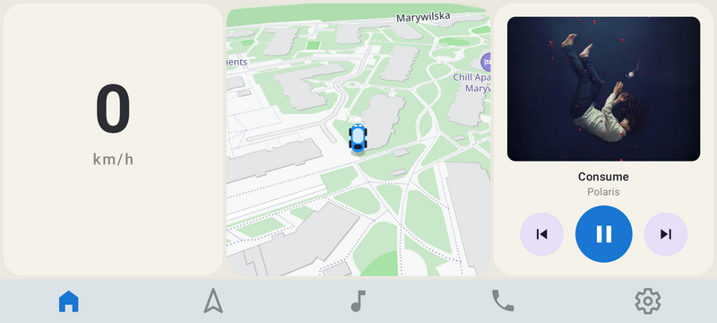
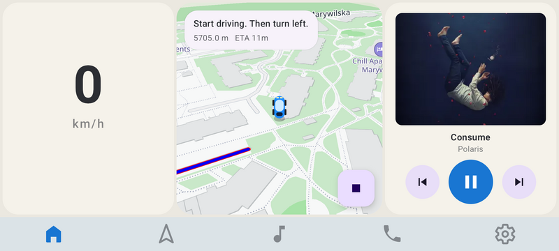
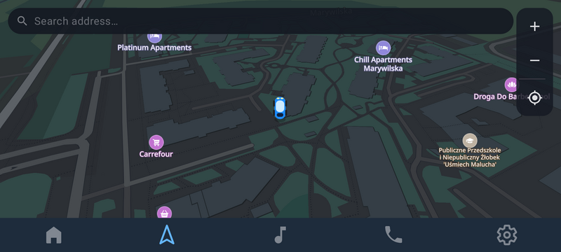
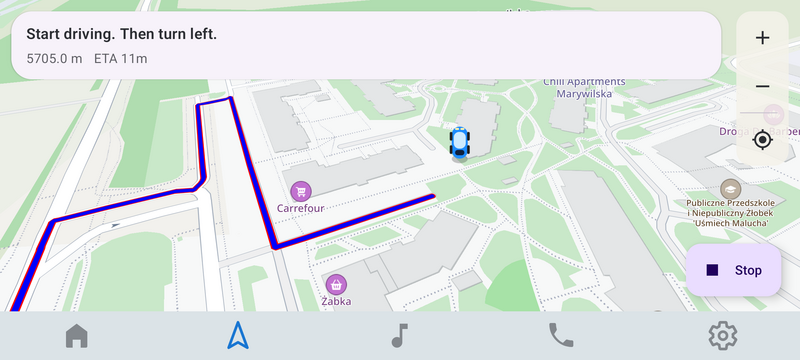
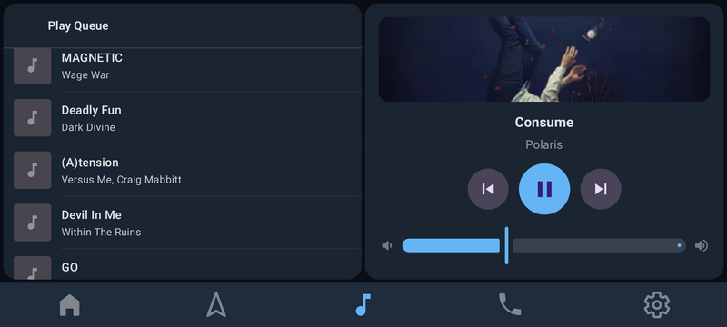
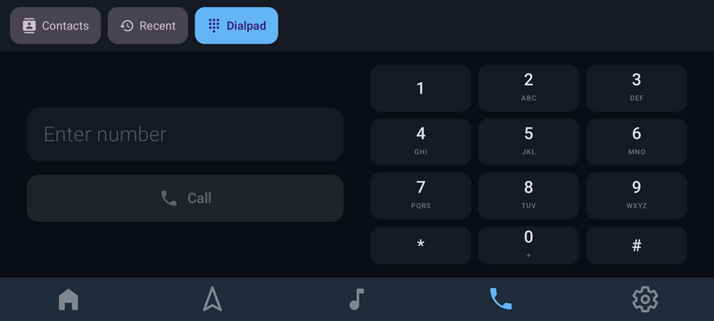
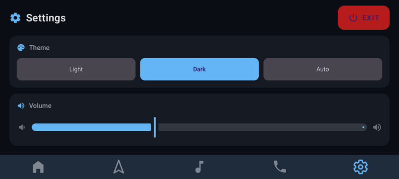
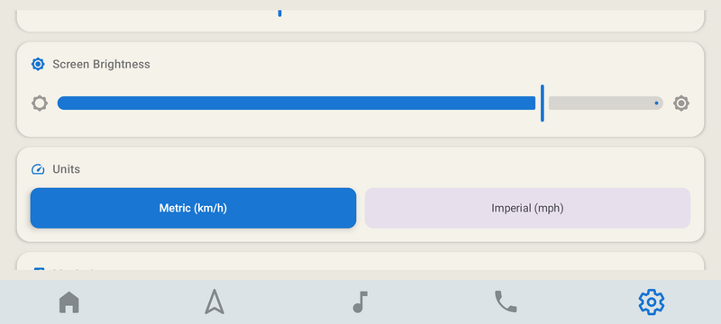

# AutoBoxLauncher

In-car UI for the **AutoBox ROM** (LineageOS 23.2 / Android 16) running on OnePlus 8 (Snapdragon 865).

A **privileged system app** that starts on boot and stays full-screen at all times via `lockTaskMode="always"`. It is not a home screen replacement — it has no `CATEGORY_HOME` and does not interact with the Android launcher stack. The only way to leave the app is through the Exit button in Settings.

> Package: `com.autobox.autoboxlauncher`  
> Installed at: `/system/priv-app/AutoBoxLauncher/`  
> Signing: platform certificate  
> Orientation: landscape (forced, 1080 × 2400 rotated 90°)

---

## Screenshots

### Home

Three-column dashboard: speed + traffic signs on the left, TomTom map in the center, media controls on the right.

<table>
  <tr>
    <td><br><sub>Dark theme</sub></td>
    <td><br><sub>Light theme</sub></td>
    <td><br><sub>Active navigation</sub></td>
  </tr>
</table>

### Map

Full-screen TomTom map with address search, route planning, and turn-by-turn navigation.

<table>
  <tr>
    <td><br><sub>Dark theme</sub></td>
    <td><br><sub>Active route</sub></td>
  </tr>
</table>

### Multimedia

Full-screen media player with play queue on the left and controls + album art on the right.

<table>
  <tr>
    <td></td>
  </tr>
</table>

### Calls

Contacts, recent calls, and a dialpad. Incoming/outgoing call UI powered by `CarInCallService`.

<table>
  <tr>
    <td></td>
  </tr>
</table>

### Settings

Theme (Light / Dark / Auto), volume, brightness, unit system (km/h / mph), media app selection, and an Exit button that leaves lock task mode.

<table>
  <tr>
    <td><br><sub>Dark theme</sub></td>
    <td><br><sub>Light theme</sub></td>
  </tr>
</table>

---

## Screens

| Tab | Icon | Description |
|-----|------|-------------|
| **Home** | House | 3-column dashboard: speed/signs · map · media |
| **Map** | Arrow | Full-screen TomTom map with navigation |
| **Multimedia** | Note | Full-screen media player + play queue |
| **Calls** | Phone | Dialpad, contacts, recent calls, in-call UI |
| **Settings** | Gear | Theme, volume, brightness, units, exit |

Navigation is a bottom bar, 52 dp tall, icons only (no labels).

### Home — column detail

**Left — Driver Info**
- Current speed from GPS (`SpeedRepository` via `LocationManager`)
- Active speed limit sign detected by the on-device camera
- Secondary road sign (warning, prohibition, etc.)
- Sign recognition covers German and Polish traffic sign sets (TFLite model, `sign_classifier.tflite`)

**Center — Navigation Map**
- Embedded `TomTomMapView` (TomTom SDK 2.1.2)
- Tap destination → calculate route → start turn-by-turn guidance
- Shows next instruction, distance, and ETA during active navigation
- Audio announcements via TomTom Navigation SDK

**Right — Media**
- Album art, track title, artist
- Play / Pause / Previous / Next
- Auto-connects to any installed media app via `MediaBrowserService`
- Preferred media app is configurable in Settings

---

## Architecture

MVVM — no DI framework (Hilt/Koin not used).

```
AutoBoxApplication
└── MainActivity
    ├── MainViewModel
    │   ├── MediaRepository       — MediaBrowser connection + playback control
    │   ├── SpeedRepository       — GPS speed via LocationManager
    │   ├── SignsRepository       — Traffic sign recognition (StateFlow)
    │   ├── CameraCapture         — Camera2 → byte array → SignsRepository
    │   └── TomTomSdk.navigation  — Turn-by-turn navigation state
    └── UI (Jetpack Compose)
        ├── HomeScreen
        ├── MapScreen
        ├── MultimediaScreen
        ├── CallScreen
        └── SettingsScreen
```

Settings are persisted with **DataStore Preferences** (`SettingsDataStore`).

State flows top-down: `StateFlow` / `Flow` in repositories → `StateFlow` / `State<T>` in `MainViewModel` → observed in Compose screens.

---

## Tech Stack

| Layer | Technology |
|-------|------------|
| Language | Kotlin (no Java) |
| UI | Jetpack Compose + Material 3 |
| Navigation | Navigation Compose (transitions disabled — required by TomTom SDK) |
| State | `StateFlow` + Compose `State<T>` |
| Async | Kotlin Coroutines + Flow |
| Maps / Navigation | TomTom SDK 2.1.2 (pre-built AARs in `prebuilts/tomtom/`) |
| Sign recognition | TensorFlow Lite 1.4.2 (LiteRT) |
| Settings storage | DataStore Preferences |
| Logging | Logback-Android |
| SDK | `minSdk = targetSdk = 35` (Android 16 ROM only) |

---

## Key Technical Notes

**Lock task mode** — `android:lockTaskMode="always"` in the manifest grants `LOCK_TASK_AUTH_LAUNCHABLE_PRIV`, pinning the app permanently without Device Owner setup.

**Navigation transitions are intentionally disabled** (`EnterTransition.None` / `ExitTransition.None`). This ensures `TomTomMapView.onDispose` fires before the next screen creates a new map instance. The TomTom SDK enforces a single-instance-per-process constraint and crashes otherwise.

**Rotation lock** — `BootReceiver` freezes the display to `ROTATION_90` via `IWindowManager` after boot. `attachBaseContext` writes `ACCELEROMETER_ROTATION=0` / `USER_ROTATION=1` to `Settings.System` to prevent the system from resetting it. `attachBaseContext` also wraps the context with `ContextThemeWrapper` for AppCompat 1.7.0 compatibility (required by the TomTom SDK).

**TomTom map lifecycle gate** — `TomTomMapView` exposes a `ready` `StateFlow`; a new map composable waits for the previous instance to fully dispose before initializing. This guards the single-instance constraint across screen transitions.

---

## Permissions

| Permission | Purpose |
|---|---|
| `ACCESS_FINE_LOCATION` | GPS speed + map positioning |
| `CAMERA` | Traffic sign recognition |
| `MEDIA_CONTENT_CONTROL` | MediaBrowser privileged binding |
| `READ_PHONE_STATE` / `READ_CONTACTS` / `READ_CALL_LOG` | Call screen |
| `ANSWER_PHONE_CALLS` / `CALL_PHONE` / `MANAGE_OWN_CALLS` | Call handling |
| `WRITE_SETTINGS` | Rotation lock via `Settings.System` |
| `SET_ORIENTATION` | `IWindowManager.freezeRotation` |
| `RECEIVE_BOOT_COMPLETED` | `BootReceiver` for rotation fix on boot |

Privileged permissions are whitelisted in [`apps/AutoBoxLauncher/permissions/privapp-permissions-AutoBoxLauncher.xml`](apps/AutoBoxLauncher/permissions/privapp-permissions-AutoBoxLauncher.xml).

